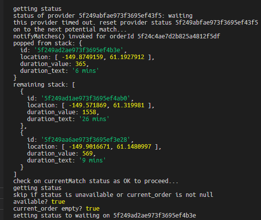

# ChoreDash API
### An instant order and dispatch queueing system for ordering services and finding the nearest available service provider.

The goal of this project was to develop a proof of concept demo for a real time ordering system. This project was inspired by apps like Uber or Doordash which provide instant location-based notifications by finding the nearest providers. This, of course, with an obviously silly twist on the product offering.

#### Major goals going into development:

- Providers are given the option to accept or deny any orders when notified within a specified time limit.
- The app runs completely server-side with API endpoints provided for all functionality.

#### Queueing system:

- When a new order is created, the provider database is queried for coordinates nearest to the customer. The search uses a radius-based 2dgraph query on an indexed collection of provider coordinates to optimize for location.
- The system creates a queue in memory of provider objects, sorted by driving distances which are retrieved from the Google Maps API. 
- Each provider is notified with basic order information, and given the option to accept or reject the order.

## Demos

**Video demo of the dispatch system in action: https://www.youtube.com/watch?v=cnIAQPniE8E**

Demo API deployment: https://choredash-api-sivadej.herokuapp.com/

Front end demo: https://modest-carson-6742b1.netlify.app/


## Docs

API v1 Specification: https://docs.google.com/document/u/1/d/e/2PACX-1vTVdwj6_MWupsMBrESbscoXJ6zBdRAbcjM5NPK-HDpIllWkXtIzgRNMLeJODObjm4R-OCX_SYJcQ_ja/pub


#### Back End Built With
- [Express (NodeJS)](#)
- [MongoDB](#)

#### External APIs
- Google Maps

##### Tools used in Development
- VSCode
- Git
- Insomnia
- Google Chrome
- MongoDB Compass

## Installation
In order to get this project up and running on your local machine, you will need to have a NodeJS environment installed, a MongoDB database, and API credentials obtained from [Google Maps](#).

- Clone repo to your local environment
- Install dependencies
- Configure environment variables
- Run server

```
> git clone https://github.com/sivadej/choredash.backend.git
> npm install
> node server.js
```

### Dependencies
See package.json

## Authors
- Sivadej Kitchpanich - [GitHub](https://github.com/sivadej) - [Website](https://sivadej.dev)